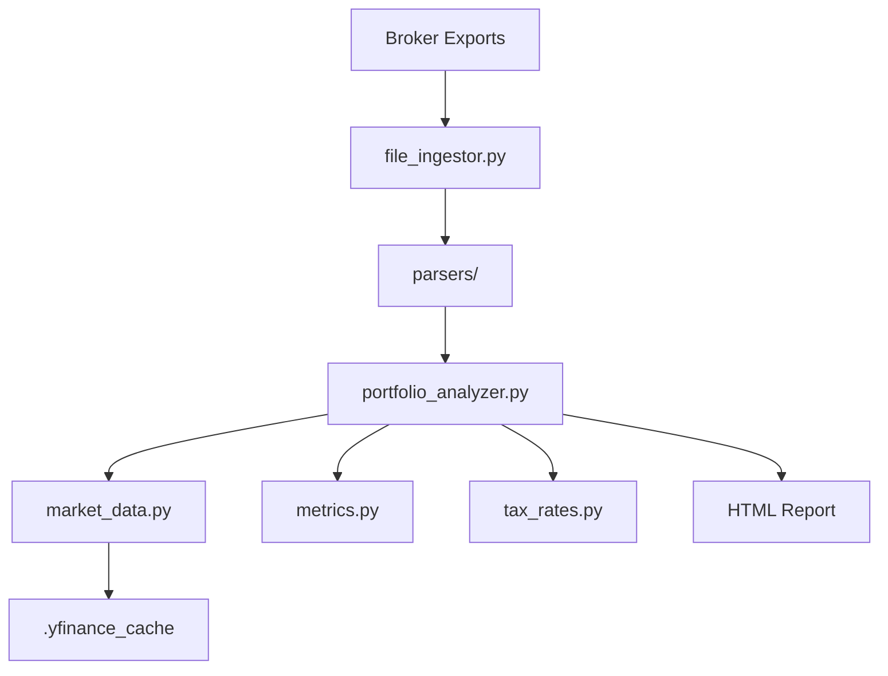

# ARCHITECTURE.md

> [!IMPORTANT]
> This document is designed for **Agentic Comprehension**. It provides a high-level technical map of the codebase for AI agents and new developers.

## 1. Project Structure
- `src/`: Core logic and engine components.
  - `portfolio_analyzer.py`: Main orchestrator and report generator. Includes automated history consolidation.
  - `file_ingestor.py`: Unified ingestion layer for multi-broker data. Supports NetBenefits naming.
  - `market_data.py`: `yfinance` wrapper with concurrent fetching.
  - `metrics.py`: Mathematical module (Sharpe/Sortino) with disk caching. Uses 5Y Goldilocks zone.
  - `validator.py`: Pre-flight sanity checks and data integrity gatekeeper.
  - `tax_rates.py` & `tax_brackets.py`: High-precision IRS/State tax logic (2026).
  - `parsers/`: Adapter layer for specific broker formats (Fidelity, etc.).
- `docs/`: Product and technical documentation.
- `.yfinance_cache/`: Persistent disk cache for ticker metadata and split history.
- `Check_History_Health.ps1`: Pre-flight hygiene tool for data range and consolidation checks.
- `pyproject.toml`: Centralized Ruff configuration for project hygiene.

## 2. System Overview
The Portfolio Optimizer follows a **Read-Only -> Process -> Report** pipeline.

## 3. Core Logic: 6-Tier Stable Routing Engine (v2)
To ensure tax efficiency and strategic alignment, assets are routed through six hierarchical tiers:
1. **Account-Specific Anchors**: Permanent assignment based on account name (e.g., Joint Brokerage).
2. **Whitelist**: Core index fund anchoring (VTI, QQQ, VOO).
3. **High-Yield Anchors**: Category-based override for REITs and BDCs.
4. **Category Anchoring**: Long-term asset type routing.
5. **3Y Beta Fallback**: Volatility lookback to ignore short-term spikes.
6. **Default Taxable**: Final fallback for unknown assets.

## 4. Data Stores & Schema
- **Primary Data Source**: Local CSV/PDF broker exports.
- **Cache**: Disk-based Pickle (`.pkl`) files in `.yfinance_cache/`.
- **In-Memory Schema**: Unified position objects with `ticker`, `account_type`, `quantity`, `cost_basis`, and `lots`.

## 5. External Integrations
- **Market Data**: `yfinance` (Yahoo Finance) for historical prices, dividends, and corporate actions (splits).

## 6. Security & Privacy Considerations
- **Local-Only**: No data leaves the local machine except for ticker-only metadata requests to Yahoo Finance.
- **PII Scrubbing**: Account numbers and exact dollar amounts are never logged or stored in plain text.
- **Read-Only**: The engine never executes trades or modifies brokerage accounts.

## 7. Future Roadmap / Architectural Debt
- **Moving from Pickle to SQLite**: To improve cache query performance and concurrent access.
- **Real-Time API Support**: Transitioning from CSV exports to direct Plaid/Yodlee integrations.
- **Frontend Layer**: Decoupling the HTML report generator into a standalone React application.
